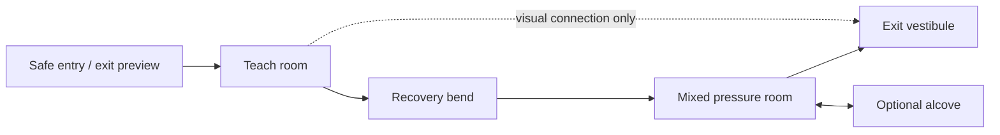
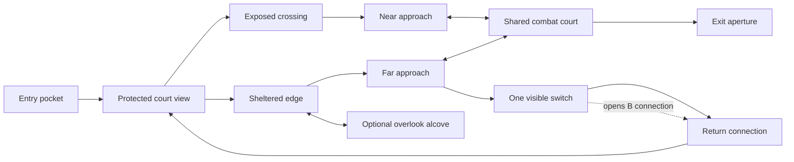
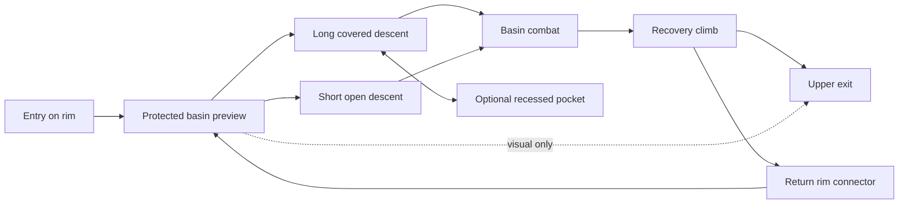

# Eyesore round 2: level layout and navigation

**Role 06 · GPT-6.1 Sol / medium · 3 October 2026.** Research and proposed experiments only. No map, gameplay, asset, build or test changes. Neither setting nor engine has been selected.

## Decision summary

Test a small neutral route before committing to an elaborate world. The prototype's flat enclosure can test turning, cover and room proportions, but cannot presently test a real locked shortcut, elevation, secret action or authored exit. Treat a paper graph and a playable map as different deliverables. Do not expand the earlier airlock/intake/service-loop/pump/reactor brief: it embeds unimplemented interactions, escalating same-role HP and an industrial progression that the user has repeatedly rejected.

Three alternatives answer different spatial questions:

- **Control C: folded linear sequence.** A clear forward route with two local combat paths; measures basic shooting/movement and whether the team can make three rooms feel different.
- **A: cross-court network.** Two parallel approaches to a shared encounter, cross-views and a shortcut that converts a previously understood room into a new tactical approach. Its identity is reading a place from multiple sides while choosing exposure versus shelter.
- **B: rim-and-basin descent.** A sequence of elevated previews, reversible descents and climbs around a central void. Its identity is choosing when to commit from observation into exposed combat and then recovering orientation from a changed height.

A is the lower capability-risk challenger; B is deliberately higher risk and should remain a drawn/blockout option until real vertical traversal works. Neither depends on archive echoes, optics, industrial pressure, choirs, rail dispatch, faction lore or a special weapon puzzle. Every alternative can use either reviewed art direction later. A level's identity must survive neutral textures.

## Evidence and audit boundaries

**PF** means project fact read directly from source. **RF** means a reference fact supported by a source. **I** means inference. **P** means an unvalidated Eyesore proposal. Numbers here are test starting points, never claims about Doom or other games. This task did not launch or play the current build.

| PF: inspected code or document | What it establishes | Design consequence / I |
|---|---|---|
| `linux-game/src/combat_world.cpp:68–76` | `descent_world()` is one 72×60-unit containment box, floor 0, ceiling 5; eight pillars and twelve full-height wall boxes subdivide it. | Subrooms are passages within one envelope; there are no linked sectors, authored ceilings or traversable height layers. |
| `engine3d.cpp:39–49,295–327` | The renderer separately repeats the room, pillar and wall constants. North/south wing placement is broadly symmetric. | Layout editing in only one copy can create invisible blocking or shots through visible walls. Symmetry plus repeated material may impair orientation; that is a hypothesis, not a measured player failure. |
| `engine3d.cpp:430–438,502–504` | Start `(0,1.42,24)`; first three foes exist immediately; clearing each current group exposes a cache at a fixed coordinate; pickup activates later groups. | Progression is kill/cache state, not movement through a progression graph. Moving a pickup alone does not create a door, unlock or valid route. |
| `engine3d.cpp:86` and movement report | Speed 2.85 units/s, Shift multiplier 2; camera Y fixed; horizontal movement. | Current room width takes ~12.6 s at unobstructed sprint; scale is too consequential to choose from room count alone. Camera anchor is not body height. |
| `combat_world.h` and `.cpp` | Cylinder blocking against boxes and swept traces exist; `World` has room/solids only. | Geometry can occlude shots, but no area IDs, floor queries, moving portals, route graph or gameplay surface tags are provided. |
| `calibration_scene.h/.cpp` | One separate declared calibration scene and solid boxes, ranged target, weapon pickup and lighting rectangles. | Useful bounded harness, not proof of level scripting or a campaign pipeline. |
| Enemy report / direct runtime review | Box avoidance/axis moves, distance awareness, no general path graph. | A loop map requires navigation and awareness fixes before encounter results are meaningful. A foe trapped behind a corner is not evidence that cover works. |
| `linux-game/src/main.c` | Separate 16×9 raycast toy map, key, medkit/ammo markers and coordinate win check. | Its progression state does not establish those capabilities in the C++ FPS. Do not mix feature claims between builds. |
| `docs/LEVEL1_DESIGN_BRIEF.md` | Proposed airlock/intake/hub/service/pump/reactor chain; key, kill gates, lift and secret; raising HP through progression. | Earlier proposal is evidence of intended work, not implemented flow or a design baseline to preserve. |

Read alongside [engine](Research2_Engine_Architecture.md), [movement](Research2_Movement_Aiming.md), [art](Research2_Art_Direction.md), [enemy behavior](Research2_Enemy_Behavior.md), [weapons](Research2_Weapon_Mechanics.md), [world interactions](Research2_World_Interactions.md) and [research tracker](RESEARCH_ROUND_2.md). Weapons' neutral precision/spread/area baseline and interactions' small door/key/switch/secret/exit core fit the map comparison. Enemy lore ecosystems remain unapproved and impose no room requirements here.

## Reference findings and consequences

### Doom

**RF:** Runtime sectors store floor height, ceiling height, floor/ceiling texture, light and special; linedefs connect front/back sectors and can carry special/tag data. Movement checks floor/ceiling clearance and step changes; special lines can trigger authored actions. This supports varied heights, boundaries and world state, rather than treating a room as one decorated box. [id Software: `r_defs.h`](https://github.com/id-Software/DOOM/blob/master/linuxdoom-1.10/r_defs.h), [`p_map.c`](https://github.com/id-Software/DOOM/blob/master/linuxdoom-1.10/p_map.c), [`p_spec.c`](https://github.com/id-Software/DOOM/blob/master/linuxdoom-1.10/p_spec.c).

**I:** Its useful spatial lesson is that navigation, exposure and the operation of boundaries belong together. **P:** Author each Eyesore boundary with passability, visibility and activation semantics. Use a first-look view of a destination, a reachable approach, and one later connection; test whether players can reconstruct where they came from. No Doom map topology, encounter arrangement or WAD is copied. This source inspection does not prove a universal Doom mapping formula.

### Wolfenstein 3D

**RF:** Source `OperateDoor` checks a key bit and reports locked use; door opening changes area connectivity. Pushwalls check the destination and increment secret count when accepted. [id Software: `WL_ACT1.C`](https://github.com/id-Software/wolf3d/blob/master/WOLFSRC/WL_ACT1.C).

**I:** A compact consistent threshold language can carry navigation even within constrained geometry. **P:** One recognizable normal door, one clearly different credential door, one repeated optional-secret cue. Reject first-map pixel hunting, silent locked inputs and secret-only essential supplies. The lesson is consistency; an orthogonal labyrinth is not a requirement.

### DUSK

**RF:** Official developer/publisher description presents three handcrafted episodes and separately describes survival mode. [DUSK developer listing](https://store.steampowered.com/app/519860/DUSK/). The creator's interviews were sought; one returned 403, another could not expose the relevant passage reliably. Therefore this report does not attribute a detailed navigation philosophy to Szymanski or invent exact DUSK room dimensions.

**I:** A campaign needs places and authored transitions distinguishable from wave survival. **P:** Each Eyesore room changes one spatial decision—sidestep, choose approach, cross exposure—while its silhouette and entry view communicate that decision. Test whether players describe the location without referring only to enemies. Deeper developer/video study remains a follow-up, not a disguised verified observation.

### Prodeus

**RF:** Its official listing identifies a handcrafted campaign, integrated level editor and community maps alongside retro aesthetics using modern technology. [Prodeus developer listing](https://store.steampowered.com/app/964800/Prodeus/).

**I:** Retro presentation does not dictate hard-coded content or weak authoring. **P:** Before producing numerous levels, make changing a room boundary update render/collision/traces/AI together. Measure revision turnaround for one route alteration. The product page does not prove a particular internal map schema or any exact encounter recipe.

### Boltgun

**RF:** Focus's June 2024 patch explicitly added a requested Navigation Guide showing the next objective and a recommended route; it is temporary by default and can remain displayed through a setting. [Focus: June 18 update](https://support.focus-entmt.com/hc/en-us/articles/19637153518610-UPDATE-JUNE-18-2024). Official description emphasizes fast shooting through varied environments. [Focus: Boltgun](https://www.focus-entmt.com/en/games/warhammer-40000-boltgun).

**I:** Strong genre style and weapons do not guarantee navigation clarity. The patch proves demand for guidance, not that every original layout failed. **P:** Provide an optional route-help contract and test unassisted orientation independently. It should point to the current reachable objective, understand lock state and omit undiscovered secrets. Map clarity remains a design responsibility.

### Dead Space, selective

**RF:** Motive's designers describe coordination of light, audio, fog/steam and spawning to vary stress, including quiet intervals and apparent threats that do not always resolve into an attack. [EA: Intensity Director](https://forums.ea.com/discussions/dead-space-franchise-discussion-en/inside-dead-space%E2%84%A2-4-the-intensity-director/7156401).

**I:** Approach and aftermath can be active composed experiences without constant fire. **P:** Give Eyesore a short recovery space and a preview before each new pressure pattern. Keep battle silhouettes, navigable floor and exits legible. Dynamic pursuit spawns, horror darkness and hidden punishment are outside this first spatial test; authored beat markers suffice.

## Shared spatial grammar

Everything below is **P**. Define body diameter D, body height H, selected run speed V and maximum step S from the movement/engine contract. Do not derive H from the current 1.42 camera anchor. Dimensions can be built once these are decided; until then use relative proportions and traversal times.

| Element | Starter relationship | Purpose / failure to watch |
|---|---|---|
| Ordinary traversal opening | ≥2.5D clear width; ≥H plus head clearance | Allows player steering; enemy passage must use largest intended actor radius too. Not every door must allow two actors side by side. |
| Combat throat | ≥4D width, with a widened apron on both sides | Player can cross without being pinched by collision; prevents a narrow threshold becoming the only viable firing position. |
| Main dodge region | Clear lateral movement ≥`V × (tell + projectile flight time)` for the tested threat, plus actor clearance | Supports at least one intended dodge. Measure with actual enemy attack timing rather than a decorative lane-width rule. |
| Short exposure crossing | Approximately 1–2 s at V | Enough time for a decision, not a compulsory unavoidable hit. |
| Primary engagement distance | 2–4 s travel at V | Establish sprite readability, weapon usefulness and cover reach together. |
| Recovery transition | About 5–12 s first traversal | Brief pause to orient/collect; no mandatory waiting or lore reading. |
| Cover island | At least two exits and a visually clear footprint | Breaks one threat lane while preserving another route; avoid rings with universally safe orbiting. |
| Cover height | Full cover or intentionally tested partial cover | Fixed-height current player cannot crouch; partial cover may help neither player nor enemy. Check traces. |
| Landmark | Recognizable geometry at entry and return; redundant shape/value cue | Never color alone, never only an emissive object hidden by combat effects. |

Use four classifications in each room sheet: traversable floor; impassable boundary; optional/reachable destination; decorative background. Material and sky roles must not imply false traversal. A balcony drawn as scenery cannot hold gameplay enemies until collision/aim/navigation support it. Decorative vertical composition is allowed in flat tests, but does not count as elevation gameplay.

Three teaching steps: show an isolated behavior with an escape lane; repeat it with changed entry angle; combine it with one previously learned pressure. Room exit direction should not depend on remembering the last HUD message. Required locks preview both their purpose and return route. No mandatory jumping in the first slice. Challenge can rise through angles, threat mixes and limited exposure without increasing the same archetype's health.

## Control C — folded sequence

A forward spine folds geographically so players can see the end from the beginning, but it has no required return trip. This control is a credible small map, not an intentionally dull benchmark.

| Space | Function / camera composition | Combat and route |
|---|---|---|
| S | Safe pocket; frame a distinctive notched exit wall behind a solid window. | Movement start, no active firing lane; exit is inaccessible by geography, not a fake lock. |
| T | Shallow rectangular room with an offset cover island. | One projectile role then one approach role; left/right movement around cover rejoins forward route. |
| P | Short dogleg; past room remains recognizable through rear opening. | Recovery item in plain view; next hostile preview from protected edge. |
| M | Wide room with asymmetric two-piece cover. | Precision target pressures long lane; approach foe threatens near side; spread weapon arrives before this use. Exit remains open. |
| O | Offset alcove visible through a narrow non-traversable slit. | Optional secret later; early flat traversal test uses ordinary open detour without secret claims. |
| X | Clearly distinct vestibule and authored end threshold. | Exit action; no kill-all requirement. Player may leave a surviving foe unless encounter role explicitly establishes a necessary gate. |

First version is floor 0 throughout. Clear travel spine is approximately 25–40 s excluding combat; intended complete session 3–5 min, measured rather than forced. One normal use door may be added only after the minimal interaction core exists. First experiment uses no key. A separate later lock variant can test one credential, without changing combat placement simultaneously.

## A — cross-court network

Spatial identity: a central open court is a navigational reference, while the player can choose a short exposed crossing or a longer sheltered edge. An outer connection returns behind a threat that was seen earlier. The route is learned through actual views and consistent edges, not an archive replay or an industrial service loop.

Edges N–Q and F–Q are simultaneously valid; switch K opens the return connection, not the exit. The switch is optional for completion and visible when reached. Thus no required backtrack or infrastructure puzzle drives this test. An optional later variant can use one credential on Q–X, but that is not the starter map.

**Room functions:** V teaches the whole court's location; E tests crossing exposure; R offers shelter but one close encounter; N/F are distinct staging aprons; Q combines familiar roles with two entry angles; B rewards orientation with a route shorter than retracing R; O offers an observation reward, not required ammunition; X is readable from both Q entries.

**Combat:** Two partial sight breaks in Q prevent a single edge from seeing all targets. One distant projectile role has a known silhouette and can be approached by either route. One melee approach threatens cover occupancy. Enemies use authored route permissions and sight; avoid immediately waking the whole graph through current distance-only awareness. No enemy spawns in cleared B on the first return. Pure retreat remains possible, but prolonged entry camping should fail to obtain convenient lines on every threat; alter geometry before adding arbitrary enemy immunity.

**Orientation:** Court has three unlike boundary silhouettes: notched long wall, low broad arcade opening, solid sloped profile. Route E follows open sky/value; R uses repeated sheltered columns; entry opening remains visible from F. Brightness is redundant with shape. A painted stripe can reinforce route, never supply its only meaning. B's opening reveals V directly when operated. It must not resemble a secret wall.

**Secret language:** O reward first seen through slit from R; approach a slightly inset panel with visible jamb discontinuity from F. Same cue is first taught by an already-open example near S. Optional use action later reveals it. Secret discovery cannot require firing at arbitrary texture blemishes, listening on headphones or jumping on an unmarked prop.

**Feasibility:** Flat A can be partitioned within a single containment envelope using shared boxes. Genuine switch/shortcut and secret need interaction state; actor navigation needs graph support. Initially mark B as permanently open and treat O as an ordinary detour to test spatial recognition; do not claim the unlock/secret test was performed. Decorative sky opening requires renderer work but is unnecessary in graybox.

## B — rim-and-basin descent

Spatial identity: the destination is visible below before it is reachable. The player sees a fight from a protected rim, chooses a descent approach, crosses the basin, and leaves from a climb that reveals the original entry from a new elevation. This system uses actual vertical contrast and controlled commitment; no fictional machinery is needed.

**Vertical contract:** Rim is initially +0.75H over basin as a test hypothesis; both descents are walkable ramps or steps ≤S, not mandatory drops. Return connector is reachable without jumping. No room-over-room overlap is required: horizontally separate rim and basin footprints suit a sector engine. Stair treads and ramp slope are decided by movement testing, not decorative proportions. Falling from the rim needs a validated recoverable landing route; if that capability is absent, rim has a clear solid barrier.

**Combat and sightlines:** V is a safe preview with solid parapet and no attack line until the player enters a clearly exposed stance. D gives a fast frontal approach with two short shelter points; L gives a slower oblique approach with one near melee check. Basin has an offset tall cover slab breaking the far shooter lane. Upper exit provides orientation, not a compulsory elevated sniper encounter. All initial enemy feet remain on the basin plane; elevation changes player navigation first. A later elevated-enemy test is separate and requires vertical aim policy/sprite grounding.

**Pacing and navigation:** Quiet rim preview, a small fight on either approach, combined basin pressure, recover on U, look back from X. The initial destination is recognized through silhouette even when seen from below; do not put the only exit marker on a face invisible from Q. A player who retreats to V can choose the other descent without a puzzle reset. Spatial teaching is a physical reveal of a future route, not a screen message or locked objective.

**Secrets:** O is a recessed pocket seen obliquely from V and reached from L. First version is an optional visible detour; a later concealed panel uses the same grammar as A. Do not hide the essential escape climb as a secret. A reward on a ledge requires an obvious legal approach and no precision jump.

**Feasibility:** This cannot be faithfully assessed with the current fixed-Y player. Flat B would test another two-route court and erase its defining question. Keep B on paper until floor support, step/ramp collision, gravity/landing, camera response, vertical traces and nav are validated. Godot/C++ sector comparison should use this exact vertical requirement as a capability checkpoint, not assume an engine name solves it.

## Exact starter-map experiment and gates

**Recommended P:** Build C first after canonical geometry and basic world definition exist; compare A in the same neutral palette once C is reliable. Retain B as the higher-risk challenger for a later vertical checkpoint. This is a research recommendation, not permission to implement.

**C starter definition:** Five spaces S/T/P/M/X; one open optional alcove; one precision and one close-spread weapon; two enemy roles; three combat beats, no boss or new archetype; flat floor, no key/switch/secret mechanic, no respawns, no required kill gate. Distinct geometric landmarks are included in graybox. Exit completion/reset uses the minimal interaction contract. A layout variant holds weapon values, actor HP, enemy composition, input settings and pickup budget constant; adjusts position only where topology requires it and documents that adjustment. Do not judge art/audio on placeholder content.

1. **Paper graph check:** Enumerate state-free reachability and walk routes. Every required destination reachable from S; optional detour removable without breaking completion. All illustrated visual edges distinguished from traversal edges. Check 2D embedding: the graph alone cannot reveal overlapping rooms, wall holes or impossible sightlines.
2. **Solo empty-map pass:** Walk each branch both directions, circle each island, reverse in each throat and inspect return view. Capture entry/return frames. Check largest intended actor passage separately. Fix render/collision disagreement and sticky corners before user navigation evaluation.
3. **Two or three naive players, C:** No spoken navigation instruction. First pass unassisted; record time, turnbacks, repeated door attempts, observed room names and route memory. Ask after completion to sketch adjacency and point toward entry/exit from M. A long confusion episode is a bug/design report, not proof of welcome exploration.
4. **C/A comparison:** Counterbalance order for 4–6 participants when possible; use the same art-light values and combat rules. Ask which route they chose and why; distinguish tactical choice from accidental wandering. An optional guide run follows, never precedes, the unassisted run. Tiny samples identify failure patterns, not statistical superiority.
5. **B capability and feel check later:** Traverse both descents/climb empty; stand on all floor transitions; shoot from every height; retreat after landing; verify no camera-only elevation. Then use the matched two-role encounter.

| Proposed acceptance / rejection observation | How to interpret it |
|---|---|
| All starter participants reach exit without coordinator rescue; no lockout or geometry trap. | Hard functional expectation; one failure requires investigation. |
| A participant stalls ≥30 s repeating already-tried links while unable to name the destination. | Trigger layout/cue revision; 30 s is a triage hypothesis, not a universal fun threshold. |
| Most participants recognize at least three spaces by shape and can point roughly toward entry from M/Q. | Supports orientation; ask why outliers failed before averaging them away. |
| A players identify exposure/shelter differences and deliberately use both approaches across first/replay runs. | Supports tactical choice. If one route dominates for every player, reassess threat lines, travel cost and reward. |
| Repeated safe threshold shooting eliminates all tactical movement. | Rework lines and approach aprons; do not close retreat by default. |
| Secret ignored, yet non-secret completion and resource recovery remain viable. | Confirms secret optionality; its discovery rate alone is not a pass/fail metric. |
| B players can explain the basin/exit relationship and recover after taking either descent. | Supports vertical orientation. Confusion caused by aim/camera/nav failures invalidates spatial conclusions. |
| Same-layout guides fix confusion but not room recognition. | Guide is mitigation; revise landmarks too. Never use guide success as proof the map itself is clear. |

## Coordinator revision: matched placement and ungated completion

The topology comparison cannot promise identical difficulty merely by retaining actor counts. Topology changes how soon the player sees threats, how many are active, what blocks their shots and how far the player must cross. Those are part of the spatial design, but they must be measured so an orientation preference is not mislabeled as proof of better combat balance. All procedures below are **P**; no new tests were run.

### A reproducible matched-placement specification

Name this experiment **Spatial C/A**, distinct from the encounter report's separately proposed control. Use three fixed actor IDs: `ranged_teach`, `approach_teach`, `ranged_mix`, plus `approach_mix` in the final beat. Total four actors of two roles. The ranged teach actor alone supplies beat 1; approach teach supplies beat 2; final beat combines the other two. This is a deliberately bounded starting roster for the topology question, not a production difficulty recommendation. If the encounter owner changes counts, change both map variants together and record the revision.

Define one local fight module per beat with an entry survey marker, activation boundary, threat anchor, full-cover footprint and downstream recovery boundary. Use the same footprint and relative local coordinates in C and A for the first comparison. Topology connects these modules differently; it does not initially stretch or rotate their internal threat geometry freely. Local distances are defined as travel time at the selected V, then converted to world units.

| Variable | Held identical in Spatial C/A | Necessary change / recorded covariate |
|---|---|---|
| Combat rules | Same movement/aim, body dimensions, weapons, spread seed, actor role/HP/radius, awareness rules, tell/commit/recovery/damage, ammo/resource values and difficulty. | None between variants. Change one shared configuration for both if calibration fails. |
| First threat reveal | Survey marker to visible threat anchor: straight distance `3V`; initially isolated role; same occluder arrangement and silhouette contrast. | A has two valid incoming approaches later; actual player's first-visible location may differ. Log the real event, not only the designed marker. |
| Activation | Same once-only crossing rule with no spawn on crossing; actors physically present, dormant before commitment. | A permits approach from either side. Both side boundaries activate the same actor ID and never duplicate it. |
| Cover and dodge | Same island footprint, nearest reachable full-cover distance about `1V`, lateral clear dodge distance based on the shared tell/flight calculation. | Approach direction changes which cover face is nearest; log path distance and visible threat count on entry. |
| Fight module footprint | Same playable area, throat clearance and anchor-to-cover relationships within each corresponding beat. | The surrounding route graph, number of connections and return views differ intentionally. |
| Supplies | Same starting inventory, item IDs/amounts, weapon availability before the relevant beat, same local distance from recovery marker. No supplies in the compared optional alcoves. | A changes travel time between beats; log pickups/arrival inventory rather than assume equal condition. |
| Visibility and presentation | Same neutral materials, threat value contrast, FOV, help setting, sound and effects. Geometry landmarks remain visible in both. | Landmark shapes and route-to-landmark views necessarily differ; these are the orientation treatment. |
| AI path access | Both roles can reach all legal positions needed for the module; bounded engagement region is the same size. | Actual route selected and cover occlusion differ. Stuck/illegal movement invalidates the run. |
| Objective/exit | Same visible use target, ready from start, no kill-count condition; same completion/reset behavior. | Geographic path length to it differs; report empty-map traversal and combat time independently. |

For the final A module, insert N and F as the two approach aprons. Place the ranged threat on the module's far anchor, the approach foe on its near offset anchor. C uses the identical module but one approach is the ordinary entry and the second is a locally reachable flank around the cover island. A's external graph makes that second approach reachable before first entry. This isolates the graph's earlier choice while retaining recognizable local combat. If the two apron views cannot have comparable first-visible range and cover access without deleting A's identity, report the mismatch explicitly and treat results as comparison of whole layouts; do not call it a controlled difficulty experiment.

**Empty-map pass first:** In both layouts, walk survey→activation→nearest cover→threat anchor→recovery along each legal approach. Record travel times and the intervals during which threat anchor rays have unobstructed lines to the player. Actor movement remains off for this geometric pass. Investigate a corresponding entry difference larger than about 20% in first-visible range or cover travel time; 20% is a pragmatic review trigger, not a statistical equivalence bound. Match local geometry if possible, otherwise retain and label the difference.

**Placement swap:** Produce placement P and its left/right counterpart Q within every module. Swap actor anchor side and cover-side relation together, without reversing the overall route graph or landmark assignment. Keep actor IDs, timings and distances fixed. P/Q exposes handedness, a preferred strafe direction or a lucky initial turn. Do not relocate pickups independently during this swap. For A's near/far entrances, record chosen entry; do not force the player down a prescribed branch in the natural-choice run.

**Small-sample counterbalance:** For four participants use first-pass assignments C/P→A/Q, A/P→C/Q, C/Q→A/P, A/Q→C/P. For six participants add one of each starting map with the less-observed placement and document the unequal cells. Participants see no layout explanation. A voluntary replay can inspect alternate entrances, but first-pass orientation and replay learning are reported separately. A forced alternate-entry pass is a diagnostic follow-up, not evidence that players freely chose both routes.

### Reporting exposure and engagement separately from orientation

For each beat record survey arrival, first threat visible, activation, first enemy windup, first incoming damage, first player shot, first useful hit, first reach of full cover, retreat, local clear and downstream recovery. Include actor ID/position, player position/heading, active threat count, HP/inventory on arrival and entrance ID. Time to engage has two explicit quantities: first-visible→first player shot (player reaction/choice) and activation→first enemy release (system timing). Do not merge them.

Report **geometric exposure** as time a stationary threat-anchor trace can reach the player; report **live exposure** as time a living, active, ready threat has a legal line while the player is in the module. Neither alone predicts damage: tell, aim commitment, flight time and player's firing choices matter. Include damage taken, shots/useful hits, time spent at entry throat, chosen route and combat duration. If instrumentation is absent, manually annotate captured footage and state timing uncertainty; do not invent precision.

Next to this, report navigation independently: empty-map spine travel time, post-beat time to the next destination, wrong-link/repeated-link attempts, optional detours, assistance, rough adjacency recall, and ability to point toward entry/exit. Avoid combining all outcomes into one score. Example interpretation: A can improve recall while increasing live exposure; that warrants adjusting encounter placement rather than dismissing the graph. A can feel easier because a second entrance bypasses a threat; that is a tactical benefit only if the player understood and chose it, rather than accidentally avoiding activation.

An early mismatch in arrival HP/ammo already confounds later combat. Show beat 1/2/3 separately and label cumulative effects. A later diagnostic may start each final module from the same inventory/HP to isolate local geometry, but that diagnostic is not the continuous level experience and cannot replace it.

### Completion contract reconciliation

The interaction report defines exit `trigger`, `condition`, `effect`, `feedback` and `persistence_scope`; it explicitly rejects total-kill requirements unless an authored set piece requires them. For Spatial C/A: trigger is use of the visible exit target; condition is player alive and transition not already committed; effect is complete this test map once; feedback is visible confirmation and end state; scope is this map/session with coherent restart. The target is ready from start. Geographic access supplies the route, with no locked panel, switch, credential or invisible clear condition on the required path. Optional A shortcut switch affects only B's return connection. No hostile actor or death-state race can trigger two transitions.

The encounters report's proposed 5–8 minute control with one announced clear gate is a different encounter hypothesis. Spatial C/A uses a 3–5 minute *initial timing expectation* with ungated exit to observe navigation and bypass behavior. These are not competing production promises. First collect empty-map travel, engaged completion and fastest legal bypass as separate observations; revise duration from those. Evaluate a clear-required encounter later by changing only that rule on the agreed spatial map, with its own explicit test brief and visible state. It is not part of the present comparison and must not be added silently to reconcile documents.

For an ungated run, reaching the exit may leave actors alive. Report surviving IDs and skipped beats alongside completion. A successful bypass is valid completion; it is not evidence that the intended combat sequence was learned. Players can be invited to make a second engagement run after the unassisted first run, reported separately. This preserves the intended research question without coercing combat through a gate.

## State, edge cases and transitions

Every route change must update passability, rendering, projectile visibility, AI connectivity and help-route data atomically under one boundary ID. Activation can be declined with clear feedback if obstructed. Player inventory/state and area state must reset together; restored saves must contain actor, pickup, lock and secret IDs. Session systems own save format, not this report.

- **Crossing a trigger backward or twice:** Encounter flag is once-only; entering and retreating cannot duplicate enemies or consume another resource. Trigger records which side entry occurred on when relevant.
- **Skipping enemies/running past:** Starter exit remains reachable. If a later level needs a kill gate, its reason and state must be visible; no invisible global kill condition.
- **Enemy blocking a required doorway:** Clearance supports passage or enemy can be displaced/defeated; a dead body must not seal the map. Passage rules need enemy and player collision review.
- **Pickup at full capacity:** Cannot lose a credential; optional sustain behavior agreed with encounter agent. Pickup is not an implicit switch unless explicitly authored and taught.
- **Switch operated from unintended side/shot:** Accepted activation mode and side are specified; failure reports no state mutation. Optional shortcut never traps an actor when closed.
- **Falling off B:** Reachable basin and legal climb; no softlock, untested damage requirement or secret-dependent recovery. Do not fake a safe ledge while collision lets player drop into an inaccessible void.
- **Leaving with surviving projectiles/enemies:** Exit activation and transition are a defined simulation event; no dead-player completion race, double transition or carried stray projectile without explicit design.
- **Low vision/muted sound/changed FOV:** Shape/value route cues survive; audio reinforces room function. Landmarks do not rely on one high-FOV screenshot.
- **Speedrunning/unusual order:** State reachability holds from every valid route; first introduction placement does not falsely assume one route was chosen. A's far approach must teach its threats if selected first.

## Cross-role handoffs

| Owner | Required interface with level role |
|---|---|
| Engine | Shared authoritative geometry, floor/ceiling support, boundary IDs, trace agreement, canonical map and capability flags; no map-specific fixes in renderer. |
| Movement | D/H/V/S, stopping/turning, run policy, maximum slope/drop and legal jump requirements. Room traversal timing retuned if V changes. |
| Enemy behavior | Radius/height, legal routes, activation/sight/hearing, committed projectile aim, stuck recovery and retreat handling. No omniscience through cover. |
| Encounters | Three beat goals, fixed roles/HP, threat direction and pickup budget; placement tested from every legal entrance. Level owns space; encounter owns resource/difficulty tuning. |
| Interactions | Minimal action vocabulary and boundary state machine; no map-script duplication of keys/doors/exit. Optional A switch remains explicitly optional. |
| Lighting | Entry/return landmark frames, floor vs wall separation, target contrast and threat-distance tests. Recovery light changes cannot silently alter combat readability. |
| Environment/sprites | Geometry silhouette first; semantic surface categories and actual sprite pixel size at main engagement distances. Props cannot accidentally make unauthorized cover. |
| Weapons/effects | Long/near/area lanes and impacts tested against authored surfaces; effects cannot obscure exit/threat tells. No geometry gimmick required for baseline loadout. |
| Audio/music | Room/portal/event IDs and tension beat markers; protected preview, combat start, recovery and exit. Sound cannot be only route cue or a random ambush contract. |
| Interface | Automap distinguishes explored/unknown, normal/locked, visual/nontraversable connections; optional help respects state and hides secrets. |
| Content pipeline | Map validator for IDs, reachability, clearances, visual/traversal edges, state combinations and snapshot views; one room edit should not require hand-updating arrays. |
| Storytelling | Can explain what spaces were for and what changed using selected world; spatial test stays neutral until evidence supports it. Lore should not rescue unreadable layout. |
| Quality | Empty-map, combat, reverse-route, skip, reset/save and accessibility observations reported separately. A failed navigation system must not be graded as a failed artistic direction. |

## Self-critique and unresolved choices

A is recognizably classic genre topology and risks becoming another generic loop. Its identity must come from deliberate cross-views and different exposure costs, not its name; if players choose blindly, reject or simplify it. B is a familiar bowl/rim pattern and may be too costly before the engine choice; its strongest benefit is a measurable new vertical decision, not apparent originality in a diagram. C may already deliver the best forward momentum. Do not choose A/B merely because they require more work.

This report has stronger verified evidence for Doom/Wolf source and Boltgun's guidance update than for DUSK/Prodeus detailed layout craft. Official product descriptions establish authorship/tooling intent, not precise mapping principles. A later reference capture pass should annotate an entry view, landmark return, secret clue and pressure transition from legally available gameplay; obtain actual observation before claiming a numerical reference standard. No source supports a universal ideal room count, playtime or discoverability percentage.

Player collision dimensions, canonical engine, movement/aim policy, enemy baseline and selected art/story are still open. Resolve those through the existing reports and small tests; drafting a 20-map campaign now would make assumptions expensive. The first convincing result is a short place players can navigate, describe and fight through with clear decisions and reliable reset. It is not a higher room/asset count.
